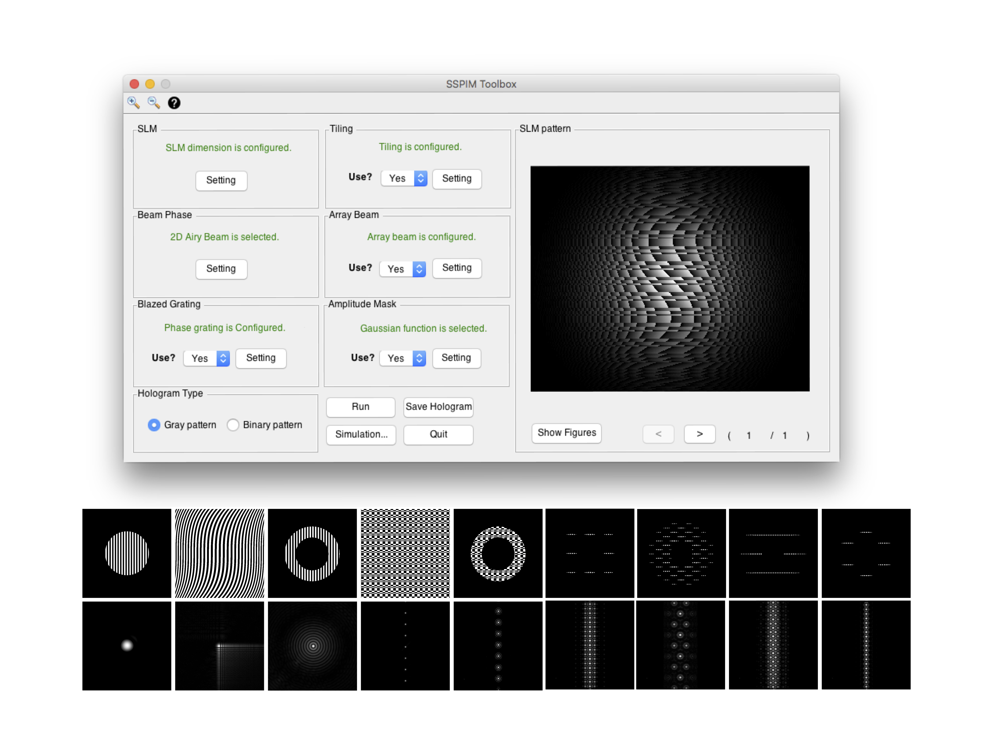

Here, we present Structured SPIM (SSPIM), which provides an open-source, user-friendly and compact toolbox for beam shaping that can generate digital patterns for a wide range of illumination beams.

# 1. Graphical user interface

SSPIM represents a toolbox to produce static, spherical Gaussian, Bessel and Airy beams by simple control of a Spatial Light Modulator (SLM). In addition, it is able to produce patterns for incoherent and coherent (lattice beam) array beam formation and tiling for all types of beams supported.SSPIM is designed with a graphical user interface (GUI) of MATLAB and is also able to work standalone. Output patterns of the SSPIM can be used with any type of SLM, such as gray scale or binary SLMs.

# 2. Capabilitis of SPPIM

The SSPIM toolbox has capabilities to generate different type of SLM patterns for a wide range optical beams using differnt methods.

∙ Static Gaussian beam 

∙ 1D Airy beam

∙ 2D Airy beam

∙ Bessel beam

∙ Incoherent Gaussian array beams

∙ Incoherent Bessel array beams

∙ Incoherent Airy array beams

∙ Square lattice beam

∙ Hexagonal lattice beam

∙ Tiling method for all type of the beams.

*SLM pattern generating for lattice beam is depended to the position of the SLM in the optical setup than to illumination objective lens.

---
∙ Damman gating 

∙ Optimal grating

∙ Amplitude mask (ellipse, annular, Gaussian, rectangular )

∙ Far field intensity prediction as a feedback.

∙ Gray value SLM pattern

∙ Binary value SLM Pattern

# 3. Download
SPPIM can be used with MATLAB or standalone. The standalone application toolbox is available for Windows and Mac.

📎 [Source codes for Windows ](https://www.google.com) (see Installation and Requirements ☟)

📎 [Standalone toolbox for Windows ](https://www.google.com) (see Installation and Requirements ☟)

📎 [Source codes for Mac ](https://www.google.com) (see Installation and Requirements ☟)

📎 [Standalone toolbox for Mac ](https://www.google.com) (see Installation and Requirements ☟)

📎 [Usermanual ](https://github.com/aakhtemostafa/SSPIM/raw/master/usermanual/SSPIM_User_manual.pdf) (see Installation and Requirements ☟)

# 4. Installation and Requirements

The Mac version of the SSPIM toolbox is implemented in Matlab 2015b and the standalone version of the SPPIM requires the Matlab Runtime 2015b (9.0).
∙ Matlab Runtime 9.0 is available in this link. 

The Windows version of the SSPIM toolbox is implemented in Matlab 2015a and the standalone version of the SPPIM requires the Matlab Runtime 2015a (8.5).
∙ Matlab Runtime 8.5 is available in this link.

